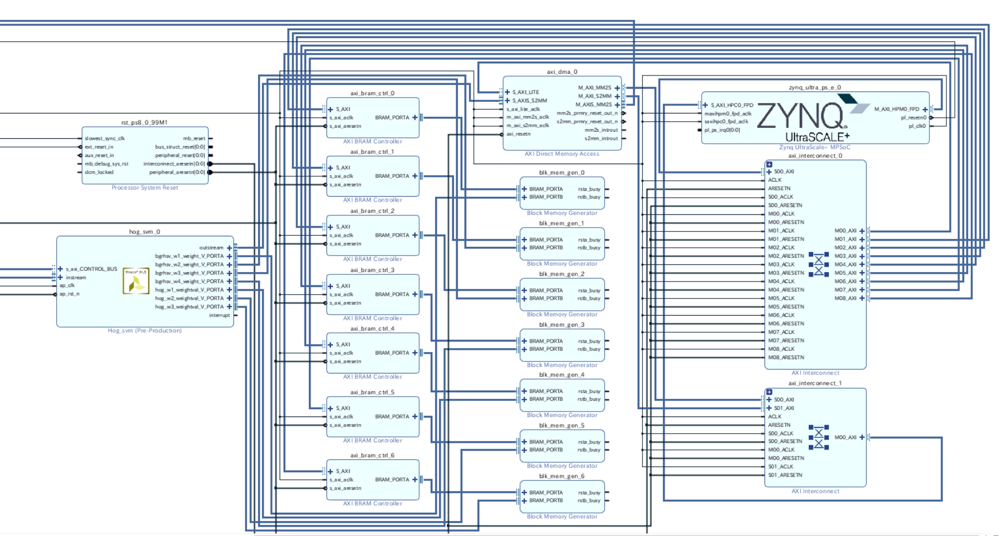

# ImageDetectionHW2  
**The 'heart2019' tag is stable **  https://github.com/lp6m/ImageDetectionHW2/tree/heart2019      
HOG/BGRHSV + SVM FPGA Implementation of Object Detection  
This system detects red traffic signal from USB webcam captured image in real time.  
System runs on Debian/Ubuntu OS on Ultra96(rev1) development board. HW Object Detection Accelerator is implemented in FPGA.  
HW Accelerator is developed by HLS, which calculates the probability of being a red traffic signal for 891(32pix\*64pix) regions in (240pix\*320pix) BGR image.
Detail of Algorithm is described in `hls/README.md`  
  
- HLS IP Latency: min:153838 max:196936 (not fully pipelined)  
- Achieved FPS: pver 142fps (including DMA data transmission time, more than 200 times faster than SW)  

## Application Example  
This system is equipped with the miniature robot car.  
Youtube Link:  
[](https://www.youtube.com/watch?v=qpykwwZaatw)  
[](https://www.youtube.com/watch?v=zwXOoCu3Y1Q)  

# Usage  
### Create SD Card for Ultra96  
First create SD Card for Ultra96 following this instruction: [ZynqMP-FPGA-Linux](https://github.com/ikwzm/ZynqMP-FPGA-Linux).  
You must install udmabuf device driver following the [instruction](https://github.com/ikwzm/ZynqMP-FPGA-Linux/blob/master/doc/build/device-drivers.md).    
Japanese instruction is [here](https://qiita.com/ikwzm/items/975ab6997905700dd2e0).  
### Install OpenCV  
After you finish setup of Debian OS on Ultra96, install OpenCV from source code like [this](https://gist.github.com/okanon/c09669f3ff3351c864742bc2754b01ea). In my environment, I use OpenCV-3.4.1 version. It takes a while.  
### Copy files to SD Card  
Copy `overlay/` and `app/` directory of this repository to rootfs partition of your SD card.  
Steps after this should be done on Ultra96 board.  
### FPGA Configuration and Device Tree Overlay  
Connect Ultra96 board by USB-serial port or ssh connection.
```
fpga@debian-fpga$ sudo -s
root@debian-fpga$ cd ~/overlay
root@debian-fpga$ cp fpga.bin /lib/firmware/
root@debian-fpga:~/overlay# ./init.sh 
hog_svm.dtb: Warning (unit_address_vs_reg): /fragment@0/__overlay__/hog_svm_0: node has a reg or ranges property, but no unit name
dma0.dtb: Warning (unit_address_vs_reg): /fragment@0/__overlay__/axi_dma_0: node has a reg or ranges property, but no unit name
```
FPGA configuration is done by this command.  
### Run demo application on Ultra96.  
#### 1. detect traffic signal from one frame image.  
```
root@debian-fpga:~# cd ~/app/hog_svm_test
root@debian-fpga:~/app/hog_svm_test# sh compile.sh
root@debian-fpga:~/app/hog_svm_test# ./a.out
1.6268558502 0.8357384801
2.9449763298 0.9500254989
2.1004710197 0.8909489512
elapsed:6.0000000000[milisec]
fps:166.6666666667[fps]
```  
`result.png` is generated as output. This file should be like [this](https://github.com/lp6m/ImageDetectionHW2/blob/image/frame.png?raw=true).

#### 2. detect traffic signal from captured image in real-time.  
First plug USB webcam to Ultra96.  
```
root@debian-fpga:~# cd ~/app/realtime_webcam
root@debian-fpga:~/app/realtime_webcam# sh compile.sh
root@debian-fpga:~/app/realtime_webcam# ./a.out
```
If red traffic signal is detected, the probability is printed to standard output.  
To avoid false positive, detection region is used.  
# Re-train and use updated SVM weight  
In this project, trained parameters of SVM used in HLS IP are saved in BRAM, and you can update parameter from SW via AXI Bram Controller.  
### Run re-train in `python/train.py`  
Modify `self.load_saved` in `python/vdtools.py` to `False`, and run `python/train.py`  
### Extract trained value from cached SVM model.  
Run `python/myestimator.py`. This code extracts trained SVM paramter. Output file is genrated to `output/weights.h`.  
### Convert float point value to 32bit unsigned int expression of fixed point.
HLS IP uses 32bit fixed point (ap_fixed<32,10>). When updating the SVM weight from SW, the weight is expressed as a 32-bit unsigned int value. Therefore, it is necessary to convert the 32-bit fixed point to the 32-bit unsigned int of the same bit string.  
Copy `python/output/weights.h` to `util/ap_fixed_convert/weight.h`. And run *ap_fixed_convert* on Vivado HLS, copy json string output to `app/hog_svm_test/weights.json`.  

# File Description  
### data  
Training data. This files are used `python/vdtools.py`  
### python  
python and scikit-learn library are used to train, verify accuracy and export trained weight to cpp header file.  
detail description is in `python/README.md`  
### hls  
HOG + SVM Vivado HLS project.
The detail description of algorithm used is in `hls/README.md`
### vivado  
You can create project by running `create_project.tcl` from Vivado 2018.2 
  
### cpp  
Some SW-level applications to verify porting from python to C++.  
detail description is in `cpp/README.md`  
### overlay  
FPGA bistream is configured and IPs are registered as `generic-uio` device by Linux Device Tree Overlay function.  
This directory contains bitstream, device tree file, and initialize shell script.  
### app  
These application only works on Ultra96, containing interface layer to call FPGA IP.
### util  
Utility program.

# Reference  
[Hua Luo, Jian & Hong Lin, Chang. (2018). Pure FPGA Implementation of an HOG Based Real-Time Pedestrian Detection System. Sensors. 18. 1174. 10.3390/s18041174.](https://www.ncbi.nlm.nih.gov/pubmed/29649146)  

## Known issue  
This SVM Classifier tends to detect false positive. This may be because of the limit of Linear SVM model.
